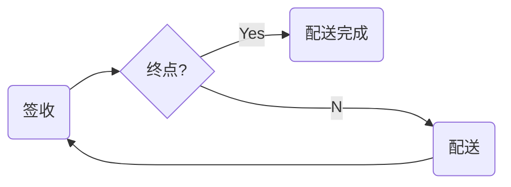

# 附录：多个配送中转站

在现实情况下，一个需要配送的商品，往往需要经过多个配送中转站才能到客户手里。其逻辑如下：



大家可以看到这里有个**环状**结构，下面我们用Nature 来解决这个问题。元数据和关系定义如下：

```mysql
INSERT INTO meta
(meta_type, meta_key, description, version, states, fields, config)
VALUES('B', 'delivery', '', 1, '', '', '');

INSERT INTO meta
(meta_type, meta_key, description, version, states, fields, config)
VALUES('B', 'deliveryState', '', 1, 'new|finished', '', '{"master":"B:delivery:1"}');

INSERT INTO relation
(from_meta, to_meta, settings)
VALUES('B:delivery:1', 'B:deliveryState:1', '{"target":{"states":{"add":["new"]}, "copy_para":[0,1]}}');

-- deliveryState --> delivery
INSERT INTO relation
(from_meta, to_meta, settings)
VALUES('B:deliveryState:1', 'B:delivery:1', '{"selector":{"state_all":["finished"], "context_all":["mid"]}, "use_upstream_id":true, "executor":{"protocol":"localRust","url":"nature_demo_executor:multi_delivery"}}');
```

上述脚本来源于 nature-demo::doc::demo-multi-delivery.sql

`delivery`：是具体的物流信息，如包含从哪里到哪里。这里我们模拟两次中转： A->B->C->D， 货物从A出发， D是终点。

`deliveryState`：是物流的状态，为简单起见，我们我们只有 new 和 finished 两个状态。

`delivery --> deliveryState` ：用于自动生成状态为 new 的配送状态数据（无需编码），具体介绍请参考[之前示例](emall-1-order-generate.md)

`deliveryState --> delivery`：用于当前配送结束后，生成后续的配送任务。

- **Nature 要点**：如果指定了多个`选择器`则选择器之间是`与`的关系，既必须同时满足才能触发`执行器`。`deliveryState --> delivery` 用到了`state_all`和`context_all`两个选择器，两个都满足后才能执行`multi_delivery`。
- **Nature 要点**："copy_para":[0,1] 是说我们要从上游复制 para 到下游，具体请看[relation.md](https://github.com/llxxbb/Nature/blob/master/doc/ZH/help/relation.md)。在本示例里我们将配送的起始地与目的地一起放到了 `Instance.para` 中。形式如 “/A/B”。
- **Nature 要点**：`delivery --> deliveryState` 和 `deliveryState --> delivery` 构成了一个业务上的**循环**，而我们避免了 loop, for 和 while 等这些编程元素。

来看下我们的编码工作，配送单的输入请参考：nature-demo::multi_delivery.rs, 执行器的代码请参考：nature_demo_executor::multi_delivery

