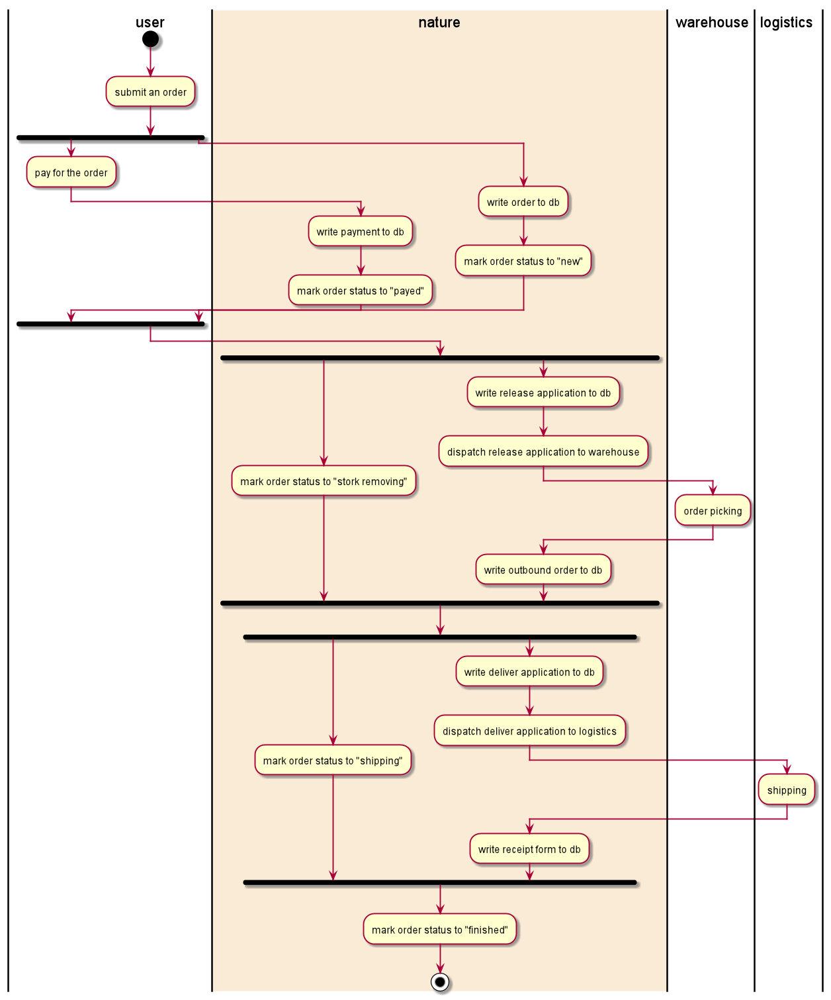
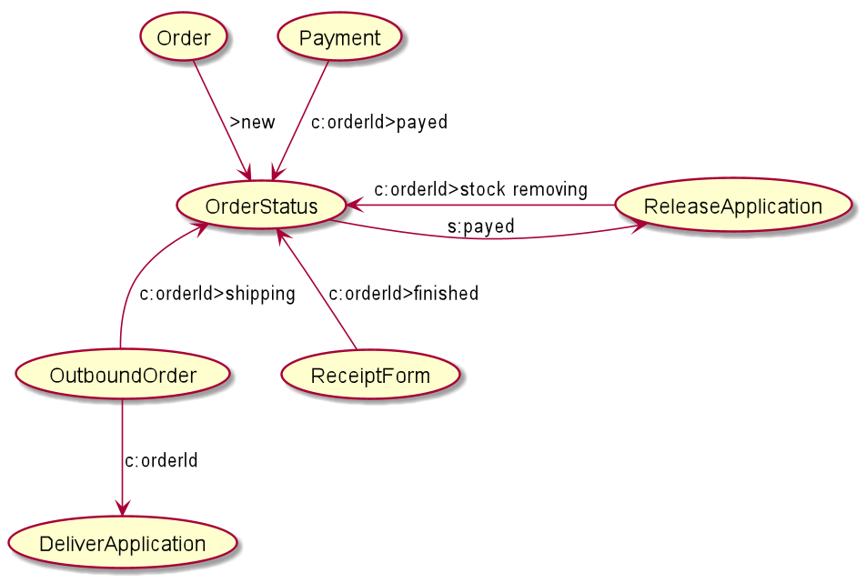

# plan for demo

## statistics

```sql
INSERT INTO meta
(full_key, description, version, states, fields, config)
VALUES('B:statistics/productConsume/total/minute', 'total sold every minute', 1, '', '', '{}');

INSERT INTO meta
(full_key, description, version, states, fields, config)
VALUES('B:statistics/productConsume/sex/minute', 'total sold every minute', 1, '', '', '{}');

INSERT INTO meta
(full_key, description, version, states, fields, config)
VALUES('B:statistics/productConsume/ageRange/minute', 'total sold every minute', 1, '', '', '{}');

INSERT INTO meta
(full_key, description, version, states, fields, config)
VALUES('B:statistics/productConsume/total/hour', 'total sold every minute', 1, '', '', '{}');

INSERT INTO meta
(full_key, description, version, states, fields, config)
VALUES('B:statistics/productConsume/sex/hour', 'total sold every minute', 1, '', '', '{}');

INSERT INTO meta
(full_key, description, version, states, fields, config)
VALUES('/B/statistics/productConsume/ageRange/hour', 'total sold every minute', 1, '', '', '{}');

-- orderState:paid --> consumeInput
INSERT INTO relation
(from_meta, to_meta, settings)
VALUES('/B/statistics/product/consumeInput:1', 'M:statistics/productConsume/task/minute:1', '{"delay":70, "executor":[{"protocol":"localRust","url":"nature_demo_executor.dll:consume_input"}]}');
```

## find use case

use_upstream_id

self convert to self, 

task_error : can't finish the task

context

### 对“/” 分隔符的作用

用于可视化业务领域的分级管理

## 查分

业务情景，通过一个学生ID 利用`converter` 查询各科的成绩，然后求这个ID的总分。

Nature 技术点： after_finished 转换器设置。

## `MetaType::Null`

This `converter` does not generate any thing to Nature, the reason is `to_meta` is "**/N:1**", it's `MetaType::Null`.  But why this is usable?  in this demo, we want to notify the warehouse,  and Nature can achieve it **reliably**.  

## Converter settings

use_upstream_id

| field           | value description                                            |
| --------------- | ------------------------------------------------------------ |
| use_upstream_id | If this is set to "true", the `orderState` instance's id will use `order` instance's id. |

### Nature key points

**`use_upstream_id`** property will be convenient for state data and it can only used to **state data**, because converter can return many **normal data**, the same id would make them conflict.

## Define `converter`

| field      | value description                                            |
| ---------- | ------------------------------------------------------------ |
| proportion | weight value among the executor list. high weight will get high chance to process the job. |


## refund


## unfinished

###### 

## plan goals

This is the first step for manager, Let list what data we wanted.


All this must defined in Nature. otherwise Nature will refuse to accept it. Don't be afraid of the class diagram, you need not to write any code, just fill these goals to Nature DB's table: `meta`.  I had written the sql for you

```sqlite
INSERT INTO meta ("full_key",description,version,states,fields) VALUES
('/B/Sale/Order',NULL,1,NULL,NULL),
('/B/Sale/OrderStatus',NULL,1,'new,payed,stock removing,shipping,finished',NULL),
('/B/Finance/Order/Payment',NULL,1,NULL,NULL),
('/B/Warehouse/ReleaseApplication',NULL,1,NULL,NULL),
('/B/Warehouse/OutboundOrder',NULL,1,NULL,NULL),
('/B/Logistics/DeliverApplication',NULL,1,NULL,NULL),
('/B/Logistics/ReceiptForm',NULL,1,NULL,NULL);
```

__Notice:__ I used the form "/B/level1/level2/../level_n/your_goal" for each goal.  The "/B" is `Meta Type` for `Businuss`, this is must be the first part of the `full_key`. And the "level1" to "level_n" are used to organize you goals, they are important for a great deal of goals.

__Notice:__  I specified status field for the `OrderStatus` goal, it is the only one for this example.

## Specify how and who achieve the goals

The second step is design path from one goal to another, let's see:



I drew the picture intent to make you understand easily. in actually the data makes up this picture comes from another table: `one_step_flow`. Let's see:

```sqlite
INSERT INTO one_step_flow
(from_meta, from_version, to_meta, to_version, settings)
VALUES('/B/Sale/Order', 1, '/B/Sale/OrderStatus', 1, '{"executor":[{"protocol":"LocalRust","url":"nature_integrate_test_executor.dll:rtn_one","proportion":1}]}'),
('/B/multi_downstream/from', 1, '/B/multi_downstream/toA', 1, '{"executor":[{"protocol":"LocalRust","url":"local://multi_downstream","proportion":1}]}'),
('/B/multi_downstream/from', 1, '/B/multi_downstream/toB', 1, '{"executor":[{"protocol":"LocalRust","url":"local://multi_downstream","proportion":1}]}');

```

The `from_meta`, `from_version`, `to_meta`, `to_version` represent the arrow's direction on the picture. The settings is little complex. It's a [JSON object](../Nature/doc/help/reference.md#settings)


Just like the table name, each row only flow one step. and we can connect the rows to the picture above.


## runtime

多个库房的问题

多次中转的问题