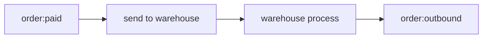

# stock-out

When the order was paid we should carry out the contract. The first step is stock-out. But we suppose that the warehouse system is old and slow, and that would cause timeout, so we need another mechanism to resolve the problem: callback.

## Some limited

In real conditions, an order's may include variant goods, these goods may involves many warehouses,  and each of them need to be traced separately. I don't want to make this chapter too complex, so I suppose there is only one warehouse can be used.

## Define `converter`

```sqlite
-- orderState:paid --> Null
INSERT INTO relation
(from_meta, to_meta, settings)
VALUES('/B/sale/orderState:1', '/N:1', '{"source_state_include":["paid"]},"executor":[{"protocol":"http","url":"http://localhost:8082/send_to_warehouse"}]}');
```

### Nature key points

`MetaType::Null` : when you just want to call the converter and the downstream is meaningless, you can use "/N:1" as the to-meta.  

`Protocol::http`: Nature can post a request to a restful implement converter.

## The process flow



